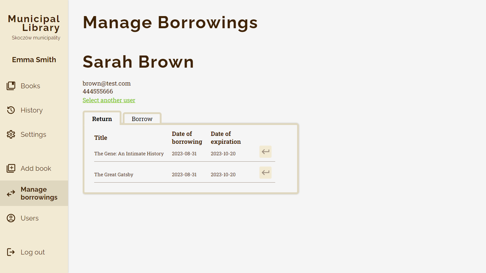

# Book Library

Live demo:
 
https://book-library-mern-app.netlify.app/
 
*Login in with `example@test.com` and `pass1234` to check it out!*

### General description
This is a fullstack web application built on top of a REST API I have written before.
It's a website dedicated for a fictional library.
It can be used for browsing data about books, borrowing them to the users and many other activities, which are mentioned in the repository for the server-side.

*Backend repository*
 
https://github.com/dkacza/library-api

### Technical details
The application uses React.js on the client-side and Express.js with MongoDB on the server-side. It was designed and prototyped with Figma.
Throughout the development I have used many 3rd party npm packages for better development experience, like styled components, react router or react use form.
I have equipped this application with a complex validation and error handling mechanisms in order to prevent unauthorized access or corruption of data.

### Screenshots

### How to run it?
I encourage you to try my app through a live demo, but you can also set it up locally on your machine.
1. Clone the repository and run `npm install` inside the folder.
2. Set up the backend *(optional)*
     
    If you want to use a locally running backend instead of the remotely hosted one you have to change the `API_URL` variable inside the `src/api/axios.js` file. Just uncomment the line with localhost address.
     
    To see how to run the backend locally, refer to the instructions posted in its repository.  
3. Run `npm run start` and you're good to go!
